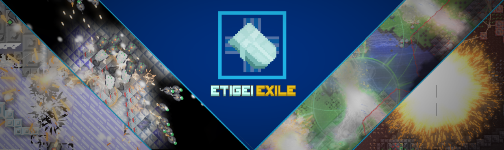

## **Etigei Exilium**

Succesor to the defunct and incomplete v6 Etigeox mod. After four years of intermittent development, the latest iteration of the Etigeox mod has finally released! Etigei Exile offers a fresh and uniquely creative modded experience, featuring 19 sectors over 2 planets.

Establish colonies on the frozen planet of Neoulandia and experience destructible environment, such as destructible trees from which you can harvest timber, emphasis on unit cargo, and unique map design. The entire Neoulandia campaign is intimately interconnected with each map being adjacent and connected, branching into economy-focused sectors or classic survival or attack maps.

Rubiginosus presents a collection of hardcore maps, inspired by Rusted Warfare, initially designed for multiplayer using Serpulo and Erekir technology. These missions have been retrofitted for a campaign experience with unique challenges for each map. Completing the Rubiginosus campaign will unlock a special resource on Neoulandia.

## **Discord**
Found a bug? Want to share suggestions? Want to connect with a community? Join the [**Discord**](https://discord.com/invite/TJKZgr6UDg)   server. We highly appreciate any feedback.

## **Development Roadmap**
Future development is divided into four phases, which will each add several maps and mechanics:  
- **Phase 1**: The starting release, introducing the core gameplay and mechanics. (Done)
- **Phase 2**: Adds nickel and platinum, with higher-tier blocks using specialized parts and T2 units. (Done)
- **Phase 3**: Adds a higher tier consisting of white titanium.
- **Phase 4**: Finally implements Etigeum to Neoulandia.

## **FAQ**

### **What’s the story behind four years of development?**  
The Etigeox mod began in 2021 as a project to create a Mindustry mod with content inspired by the Etigeox Universe. Initially, it focused on a higher-tier of blocks for Serpulo. Over time, the Rubiginosus maps — initially standalone multiplayer experiences — were incorporated into the main mod. Since its inception, the mod has undergone four rewrites to reach its current form. We will not be doing a fifth rewrite.

### **What is the Etigeox Universe?**  
The Etigeox Universe is a collaborative creative writing project by mod authors Mitemi and Superwibr. Though, no content has officially been published, extensive worldbuilding and a short novel have been completed. Message the developers on Discord for more information.

### **What’s next?**  
Future updates will continue to build on gameplay depth, with new units, maps, and lore-rich mechanics planned for upcoming phases. See the roadmap above.

### **The sprites aren’t great!**  
We aren't great at spriting.

## **Developed by:**  
- Mitemi
- Superwibr  